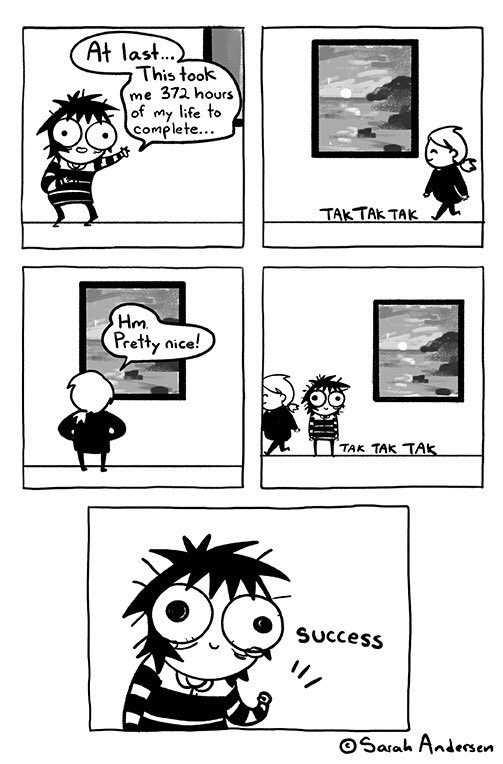

<a href="https://henestrosa.dev">
  <picture>
    <source media="(prefers-color-scheme: light)" srcset="https://github.com/HenestrosaDev/HenestrosaDev/blob/main/banner-light.png">
    <source media="(prefers-color-scheme: dark)" srcset="https://github.com/HenestrosaDev/HenestrosaDev/blob/main/banner-dark.png">
    
  </picture>
</a>

---

### 👤 About Me

¡Hola! My name is José Carlos, but online, I go by my _second_ last name, Henestrosa—yes, we have that in Spain. I'm a **software developer** driven by the excitement of turning ideas into user-centered software solutions that have a positive impact on society. I also enjoy sharing programming insights on my [blog](https://henestrosa.dev/blog) and playing the guitar when I'm offline.

Here are some technical aspects that people are often curious about:
- My go-to web stack for dynamic websites is VILT ([Vue](https://github.com/vuejs/core), [Inertia](https://github.com/inertiajs/inertia-laravel), [Laravel](https://github.com/laravel/laravel), and [Tailwind CSS](https://github.com/tailwindlabs/tailwindcss)). For static websites, I'm keen on [Astro](https://github.com/withastro/astro).
- Since my work focuses on mobile development, I'm "forced" to use [Xcode](https://developer.apple.com/xcode/) and [Android Studio](https://developer.android.com/studio), but I always enable [Vim](https://github.com/vim/vim) key bindings in both. For other platforms, I currently rely on [Visual Studio Code](https://github.com/microsoft/vscode) with the [VSCode Neovim](https://marketplace.visualstudio.com/items?itemName=asvetliakov.vscode-neovim) plugin, along with other plugins. However, I'm seriously considering switching to [Neovim](https://github.com/neovim/neovim) once I find the time to configure it to my liking.
- For accessibility reasons, I use tabs instead of spaces for indentation, so I highly recommend checking [your Github preferences](https://github.com/settings/appearance) > **Choose the number of spaces a tab is equal to when rendering code**.

  
-

   
  

  
   
  

---

### 📊 GitHub Stats

  
Click here to display

   
  

  
   

  
  
  

---

### 📖 Latest Blog Posts

<!-- BLOG-POST-LIST:START -->
- [Universal Links vs. Deep Links: When and how to use each](https://henestrosa.dev/blog/universal-links-vs-deep-links)
- [How to modify messages from unpushed commits](https://henestrosa.dev/blog/how-to-modify-messages-from-unpushed-commits)
- [Audiotext reached 100 stars!](https://henestrosa.dev/blog/audiotext-reached-100-stars)
- [How to add the &quot;Show project&quot; button to a LinkedIn project](https://henestrosa.dev/blog/how-to-add-the-show-project-button-to-a-linkedin-project)
- [How to use whenLoaded in Laravel API Resources](https://henestrosa.dev/blog/how-to-use-whenloaded-in-laravel-api-resources)
<!-- BLOG-POST-LIST:END -->

---

  
  
  
  
  [![Website](https://img.shields.io/badge/Website-0077B5?style=for-the-badge&logo=data:image/svg%2bxml;base64,PD94bWwgdmVyc2lvbj0iMS4wIiBlbmNvZGluZz0iaXNvLTg4NTktMSI/Pg0KPCEtLSBVcGxvYWRlZCB0bzogU1ZHIFJlcG8sIHd3dy5zdmdyZXBvLmNvbSwgR2VuZXJhdG9yOiBTVkcgUmVwbyBNaXhlciBUb29scyAtLT4NCjxzdmcgZmlsbD0iI0ZGRkZGRiIgaGVpZ2h0PSI4MDBweCIgd2lkdGg9IjgwMHB4IiB2ZXJzaW9uPSIxLjEiIGlkPSJMYXllcl8xIiB4bWxucz0iaHR0cDovL3d3dy53My5vcmcvMjAwMC9zdmciIHhtbG5zOnhsaW5rPSJodHRwOi8vd3d3LnczLm9yZy8xOTk5L3hsaW5rIiANCgkgdmlld0JveD0iMCAwIDUxMiA1MTIiIHhtbDpzcGFjZT0icHJlc2VydmUiPg0KPGc+DQoJPGc+DQoJCTxwYXRoIGQ9Ik0yNTYsMEMxMTQuODQyLDAsMCwxMTQuODQyLDAsMjU2czExNC44NDIsMjU2LDI1NiwyNTZzMjU2LTExNC44NDIsMjU2LTI1NlMzOTcuMTU4LDAsMjU2LDB6IE0xOTQuMjcsMzQuNDMNCgkJCWMtMTAuODc5LDEwLjk0Mi0yMC44MTcsMjUuMzI4LTI5LjQwMyw0My45NDVjLTYuNTU4LDE0LjIxNy0xMi4yMjgsMzAuNTg5LTE2Ljk2NCw0Ni4zNDNINjcuMjENCgkJCUM5Ny4zNzMsODEuMzk1LDE0Mi4xMDEsNDksMTk0LjI3LDM0LjQzeiBNNTEuNDMsMTUwLjk3NGg4OS45NzFjLTYuMTExLDI4Ljg4Mi05LjY3LDYwLjM5LTEwLjQwOCw5MS44OTdIMjYuNjA3DQoJCQlDMjguMzk4LDIxMC4wNTEsMzcuMTUsMTc5Ljg1Niw1MS40MywxNTAuOTc0eiBNMjYuNjczLDI2OS4xMjhoMTA0LjM1YzAuOCwzMi44Miw0LjQxOCw2NC4zMjgsMTAuNiw5MS44OTdINTEuOTgNCgkJCUMzNy41MzQsMzMzLjQ1NiwyOC42MTQsMzAzLjI2MiwyNi42NzMsMjY5LjEyOHogTTY3LjkzMywzODcuMjgyaDgwLjI2NmM0LjY3NiwxNy4wNjcsMTAuMjQ1LDMxLjc3MiwxNi42NjYsNDUuNjkzDQoJCQljOC40MTMsMTguMjM4LDE4LjIwNiwzMi42NDcsMjguOTM2LDQzLjgxN0MxNDIuMjUxLDQ2Mi4yNzYsOTcuOTk1LDQzMC42MDUsNjcuOTMzLDM4Ny4yODJ6IE0yNDIuODcyLDQ4My42MDENCgkJCWMtMjQuOTQ0LTguNjIzLTUxLjAwNy00Mi40OTMtNjcuNDY1LTk2LjMxOWg2Ny40NjVWNDgzLjYwMXogTTI0Mi44NzIsMzYxLjAyNkgxNjguMzRjLTYuMjM2LTI2LjI1Ni0xMC4yMTQtNTcuNzY0LTExLjA2Mi05MS44OTcNCgkJCWg4NS41OTNWMzYxLjAyNnogTTI0Mi44NzIsMjQyLjg3MmgtODUuNjEzYzAuNzc2LTMxLjUwOCw0LjU0LTYzLjAxNSwxMS4wMDEtOTEuODk3aDc0LjYxMlYyNDIuODcyeiBNMjQyLjg3MiwxMjQuNzE4SDE3NS4yNg0KCQkJYzMuODk4LTExLjgxNSw4LjE3NC0yNC4yNSwxMy4yMzItMzUuMjE2YzE1LjM1My0zMy4yODgsMzQuNjg3LTU0LjU5LDU0LjM4LTYxLjEzVjEyNC43MTh6IE00ODUuMzkzLDI0Mi44NzJIMzgxLjAwNw0KCQkJYy0wLjczOC0zMS41MDgtNC4yOTYtNjMuMDE1LTEwLjQwOC05MS44OTdoODkuOTcxQzQ3NC44NSwxNzkuODU2LDQ4My42MDIsMjEwLjA1MSw0ODUuMzkzLDI0Mi44NzJ6IE00NDQuNzksMTI0LjcxOGgtODAuNjkzDQoJCQljLTQuNzM3LTE1Ljc1NC0xMC40MDUtMzEuOTk2LTE2Ljk2My00Ni4yMTNjLTguNTI0LTE4LjQ4MS0xOC4wOTEtMzMuMDQ5LTI4LjUxLTQzLjk2Mg0KCQkJQzM3MC40MTEsNDkuMjMyLDQxNC43OTksODIuNzA4LDQ0NC43OSwxMjQuNzE4eiBNMjY5LjEyOCwyOC42NTJjMTkuNjkyLDYuODc1LDM4LjgxNiwyOC4wNDcsNTMuOTQ2LDYwLjg0OQ0KCQkJYzUuMDU4LDEwLjk2Niw5Ljc2NywyMy40MDEsMTMuNjY1LDM1LjIxNmgtNjcuNjEyVjI4LjY1MnogTTI2OS4xMjgsMTUwLjk3NGg3NC42MTJjNi40NiwyOC44ODIsMTAuMjI2LDYwLjM5LDExLjAwMSw5MS44OTcNCgkJCWgtODUuNjEzVjE1MC45NzR6IE0yNjkuMTI4LDI2OS4xMjhoODUuNTkzYy0wLjg0OCwzNC4xMzMtNC44MjYsNjUuNjQxLTExLjA2Miw5MS44OTdoLTc0LjUzMVYyNjkuMTI4eiBNMjY5LjEyOCw0ODMuMzE2di05Ni4wMzQNCgkJCWg2Ny40NjVDMzIwLjMxOSw0MzkuNzk1LDI5NS4zODUsNDc0LjIyMSwyNjkuMTI4LDQ4My4zMTZ6IE0zMTkuNTg4LDQ3Ni41MjVjMTAuMDEzLTExLjExNywxOS4yMzQtMjUuNjU5LDI3LjU0Ni00My42OA0KCQkJYzYuNDIxLTEzLjkyMSwxMS45OS0yOC40OTYsMTYuNjY2LTQ1LjU2M2g4MC4yNjZDNDE0LjI3NSw0MzAuNjA1LDM3MC41NDUsNDYxLjgyNywzMTkuNTg4LDQ3Ni41MjV6IE00NjAuMDIsMzYxLjAyNmgtODkuNjQyDQoJCQljNi4xODEtMjcuNTY5LDkuOC01OS4wNzcsMTAuNi05MS44OTdoMTA0LjM1QzQ4My4zODYsMzAzLjI2Miw0NzQuNDY2LDMzMy40NTYsNDYwLjAyLDM2MS4wMjZ6Ii8+DQoJPC9nPg0KPC9nPg0KPC9zdmc+)](https://henestrosa.dev)

